# Poligon Frontend User Guide

This document provides comprehensive instructions for using the Poligon platform. Poligon is a collaborative LaTeX document management system designed for academic environments, supporting real-time collaboration, document workflows, task management, and direct messaging.

---

## Table of Contents

1. [Getting Started](#getting-started)
2. [Navigation](#navigation)
3. [LaTeX Playground](#latex-playground)
4. [Documents Page](#documents-page)
5. [Tasks Page](#tasks-page)
6. [Profile Page](#profile-page)
7. [Chat System](#chat-system)
8. [Mentor Panel](#mentor-panel)
9. [Admin Panel](#admin-panel)
10. [Keyboard Shortcuts](#keyboard-shortcuts)

---

## Getting Started

### Registration and Authentication

Poligon supports two authentication methods:

**AAI@EduHr Authentication (Recommended)**

If you are affiliated with a Croatian educational institution, you can log in using your institutional credentials. Click the **Login** button in the header, then select **AAI@EduHr Login**. You will be redirected to the AAI authentication portal where you enter your institutional email and password. Upon successful authentication, you are redirected back to Poligon with an active session. No separate registration is required — your account is created automatically on first login.

**Local Registration**

For users without AAI@EduHr access, local registration is available. Click **Login** in the header, then select **Create account**. Fill in the registration form with your email address and password. After registration, log in using the local login form with your email and password.

### User Roles

Upon registration, users are assigned one of the following roles:

| Role | Description |
|------|-------------|
| **User** | Basic access. Can use the LaTeX Playground only. |
| **Student** | Can edit documents, participate in collaboration, submit work for review, and manage personal tasks. |
| **Mentor** | Can create documents, manage students, review submissions, grade work, and oversee document workflows. |
| **Admin** | Full system access including user management, document type configuration, and system monitoring. |

Your role is determined automatically based on institutional affiliation or assigned manually by an administrator.

---

## Navigation

The header navigation bar provides access to all platform features. Available links depend on your authentication status and role.

  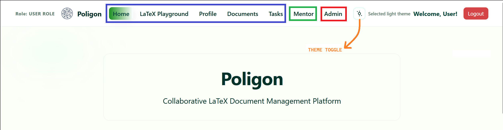
  
<em>Header navigation showing role-based menu items</em>

**Navigation Items by Role:**

- **All visitors:** Home, LaTeX Playground
- **Authenticated users (Student):** Home, LaTeX Playground, Profile, Documents, Tasks
- **Mentor:** All student pages plus Mentor Panel
- **Admin:** All mentor pages plus Admin Panel

The header also displays:
- Your current role (when logged in)
- Theme toggle button (light/dark mode)
- Welcome message with your display name
- Logout button

### Theme Selection

Poligon supports light and dark themes. Click the theme toggle icon in the header to switch between modes. Your preference is saved automatically and persists across current session.

---

## LaTeX Playground

The Playground allows you to experiment with LaTeX code without creating a document. It provides a simple editor with instant compilation and PDF preview.

  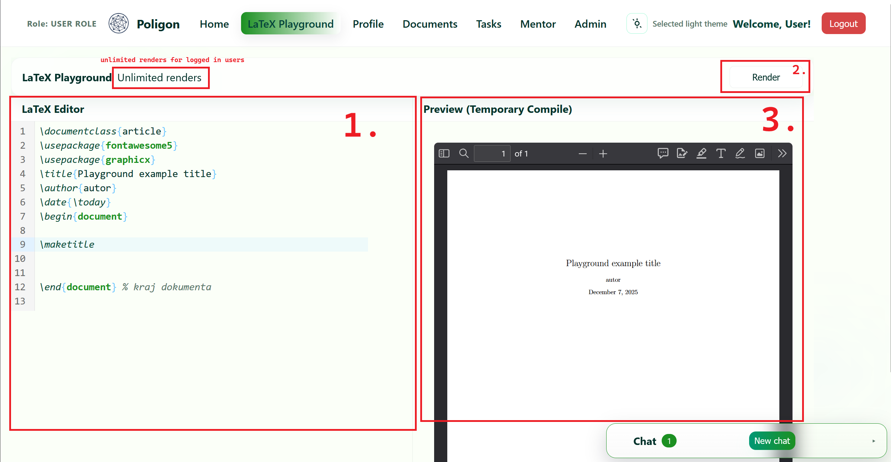
  
<em>LaTeX Playground interface</em>

**Interface Elements:**

1. **LaTeX Editor** — Write your LaTeX code here. The editor provides syntax highlighting adapted to your current theme.
2. **Compile Button** — Click to compile your LaTeX code and generate a PDF preview.
3. **PDF Preview** — The compiled output appears here after successful compilation.
4. **Render Limit Notice** — Anonymous users are limited to 15 renders per day. This limit is removed upon registration.

**Usage Notes:**

- The Playground is publicly accessible to all visitors
- Anonymous users have a daily render limit (15 compilations per IP address)
- Registered users can compile without restrictions
- The Playground does not support file uploads or collaboration features
- For full functionality, use the Documents page

---

## Documents Page

The Documents page is the primary workspace for editing LaTeX documents. It features a collaborative editor with real-time synchronization, PDF preview, task sidebar, and file management.

  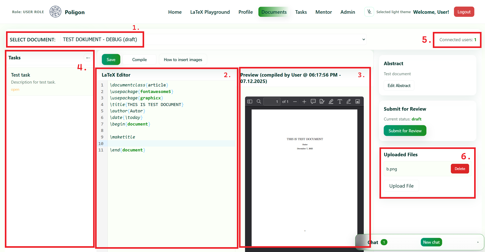
  
<em>Documents page with editor and preview</em>

**Interface Elements:**

1. **Document Selector** — Select a document from the dropdown to open it in the editor. The selector shows document title and current status.
2. **LaTeX Editor** — The main editing area with syntax highlighting. Multiple users can edit simultaneously with live cursor positions visible.
3. **PDF Preview** — Displays the most recent compilation. Shows information about who compiled and when.
4. **Tasks Sidebar** — Collapsible panel showing tasks associated with the current document.
5. **Connected Users Indicator** — Shows the number of users currently viewing or editing the document.
6. **Right Sidebar** — Contains Abstract editor, Submit for Review button, and Uploaded Files section.

### Working with Documents

**Opening a Document:**
Select a document from the dropdown at the top of the page. Your selection is saved to your session and restored when you return.

**Editing:**
Type directly in the LaTeX editor. Changes are synchronized in real-time with other connected users through Yjs CRDT technology. You can see other users' cursors as they edit.

**Saving:**
Press **Ctrl+S** to manually save the document to the server. This ensures all changes are persisted and merged with any concurrent edits.

**Compiling:**
Press **Ctrl+E** or click the **Compile** button to generate a temporary PDF preview. While one user is compiling, others cannot start another compilation (the button shows "Locked"). Once compilation finishes, all connected users automatically receive the updated preview.

**Submitting for Review:**
When your document is ready, click **Submit for Review** in the right sidebar. This changes the document status to "under_review" and disables editing for users with the "editor" role. A mentor must then either return the document to draft or assign a grade.

### File Management

  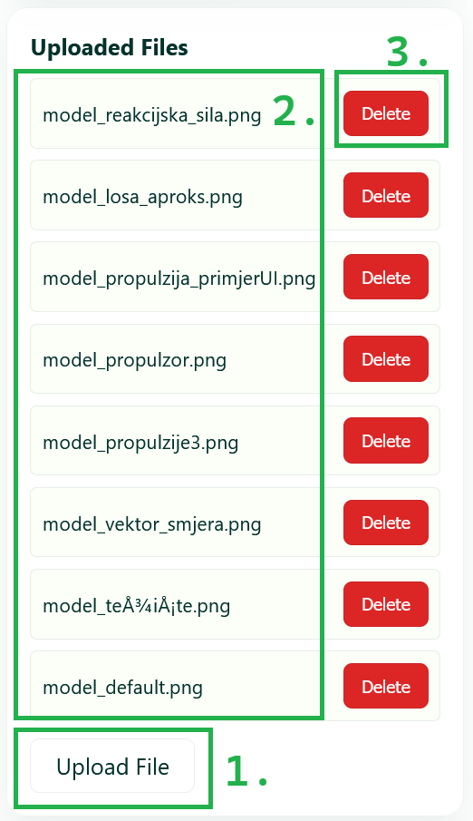
  
<em>Uploaded files section</em>

Documents can have associated files (images, PDFs, bibliography files, additional TeX files).

1. **Upload Button** — Click to select and upload a file. Supported formats: JPG, PNG, GIF, SVG, PDF, BIB, TEX.
2. **File List** — Shows all uploaded files with their names. Each file shows a delete button if you have permission.
3. **Delete Button** — Remove a file. Only the uploader, document mentors, or admins can delete files.

**Using Uploaded Images in LaTeX:**
After uploading an image, you can include it in your document using standard LaTeX commands. The editor provides an `\insertimage` autocomplete helper for quick insertion.

### Document Status Workflow

Documents progress through the following states:

| Status | Description |
|--------|-------------|
| **draft** | Document is being written and edited |
| **under_review** | Submitted by student, awaiting mentor review |
| **graded** | Mentor has assigned a grade |
| **submitted** | Document has been submitted to faculty |
| **finished** | Faculty has accepted the document |

---

## Tasks Page

The Tasks page provides calendar-based task management with filtering by document.

  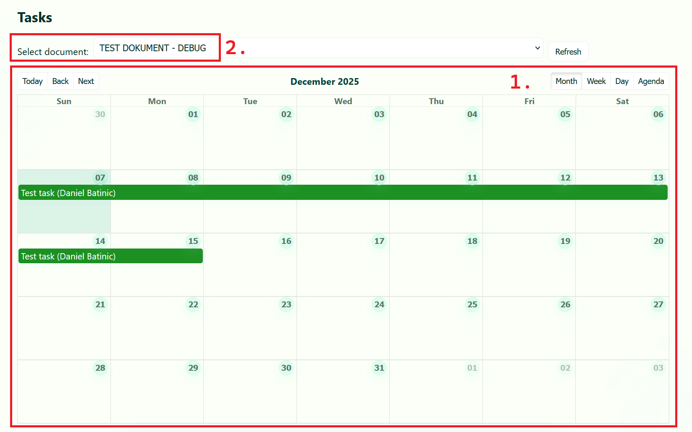
  
<em>Tasks calendar view</em>

**Calendar View:**
- Tasks appear on the calendar between their start date and due date
- Click on a task to view its details in a notification
- Closed tasks are hidden from the calendar but visible in the task list below
- Use the document filter dropdown to show only tasks for a specific document

### Creating Tasks

  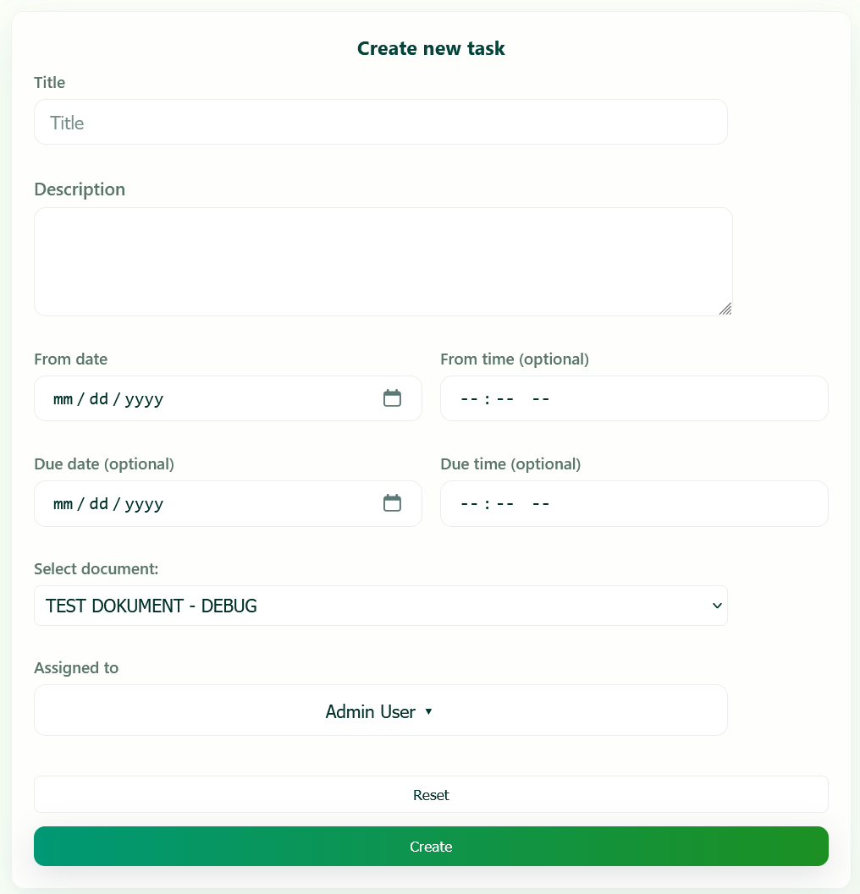
  
<em>Task creation form</em>

To create a new task, fill out the form below the calendar:

- **Title** — Brief task name (required)
- **Description** — Detailed task description
- **From date/time** — When the task starts (required). Time is optional, defaults to 12:00.
- **Due date/time** — Task deadline. Time is optional.
- **Select document** — Optionally link the task to a specific document
- **Assigned to** — The user responsible for the task. Students can only assign tasks to themselves. Mentors and admins can assign tasks to any user.

Click **Create** to save the task, or **Reset** to clear the form.

### Task List

Below the calendar, all tasks are displayed in a list format with:
- Task title and status badge (OPEN/CLOSED)
- Description
- From and Due dates
- Creator and assignee names
- Action buttons based on your permissions

**Available Actions:**

| Action | Who Can Perform |
|--------|-----------------|
| Mark closed/Reopen | Task creator, assignee, mentors, admins |
| Edit | Task creator, mentors, admins |
| Delete | Task creator, mentors, admins |

---

## Profile Page

The Profile page allows you to manage your account settings, view active sessions, and change your password (if using local authentication).

### General Information

  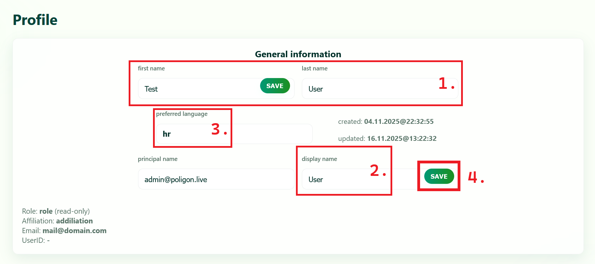
  
<em>Profile details section</em>

Editable fields:
- **First Name** and **Last Name** — Your name as displayed throughout the platform
- **Display Name** — Optional custom display name that overrides first/last name
- **Principal Name** — Your AAI identifier or email
- **Preferred Language** — Choose between Croatian (hr) and English (en)

Each field has a **Save** button that appears when you make changes. Click Save to persist individual fields.

Read-only information:
- **Role** — Your current platform role
- **Affiliation** — Your institution (from AAI attributes)
- **Email** — Your registered email address
- **UserID** — Your unique user identifier
- **Created/Updated timestamps** — Account creation and last modification dates

### Active Sessions

  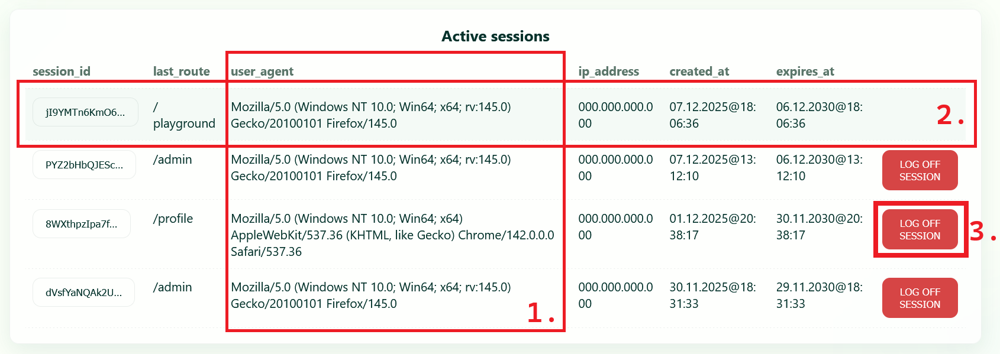
  
<em>Active sessions management</em>

This section displays all your active login sessions across different devices and browsers.

For each session you can see:
- **Session ID** — Truncated identifier (click to copy full ID)
- **Last Route** — The last page visited in that session
- **User Agent** — Browser and operating system information
- **IP Address** — The IP address of the session
- **Created At** — When the session was created
- **Expires At** — When the session will automatically expire

Your current session is highlighted. You can terminate other sessions by clicking **LOG OFF SESSION**. This is useful if you forgot to log out on a shared computer.

### Change Password

  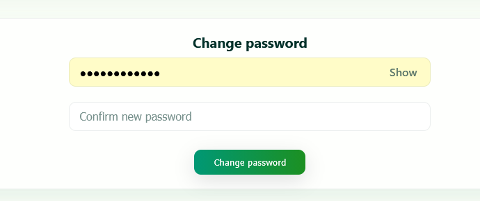
  
<em>Password change section (local users only)</em>

This section is only visible for users with local accounts (not AAI@EduHr users).

To change your password:
1. Enter your new password in the first field
2. Confirm by entering it again in the second field
3. Click **Change password**

Password requirements:
- Minimum 6 characters

After changing your password, you will be automatically logged out after a 10-second countdown and must sign in again with your new credentials.

---

## Chat System

Poligon includes a real-time messaging system accessible through a floating widget.

  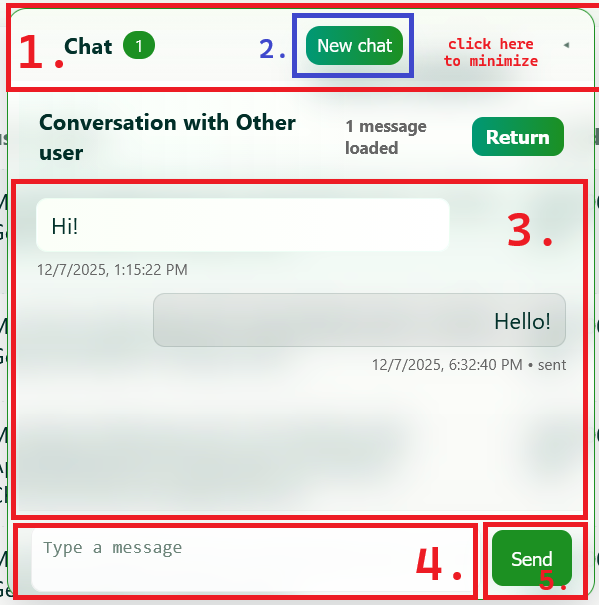
  
<em>Chat widget interface</em>

**Widget Features:**

1. **Header** — Shows conversation partner name and online status. Click "Return" to go back to conversation list.
2. **Conversation List** — Lists all your conversations sorted by most recent activity. Click a conversation to open it.
3. **Message Area** — Displays message history with timestamps. Your messages appear on the right, received messages on the left.
4. **Message Input** — Type your message here.
5. **Send Button** — Click or press Enter to send your message.

**Additional Features:**

- **User Search** — Click the search icon to find users by name or email and start a new conversation
- **Online Status** — Green indicator shows when a conversation partner is currently online
- **Message Deletion** — Right-click on your own sent messages to delete them
- **Draggable Widget** — The chat widget can be moved around the screen
- **Collapsible** — Click the chat icon to minimize the widget

**Disabling Chat:**
If you prefer not to see the chat widget, you can disable it from the Profile page.

The chat widget is not available on mobile devices to conserve screen space.

---

## Mentor Panel

The Mentor Panel provides advanced document management capabilities for users with the Mentor or Admin role.

  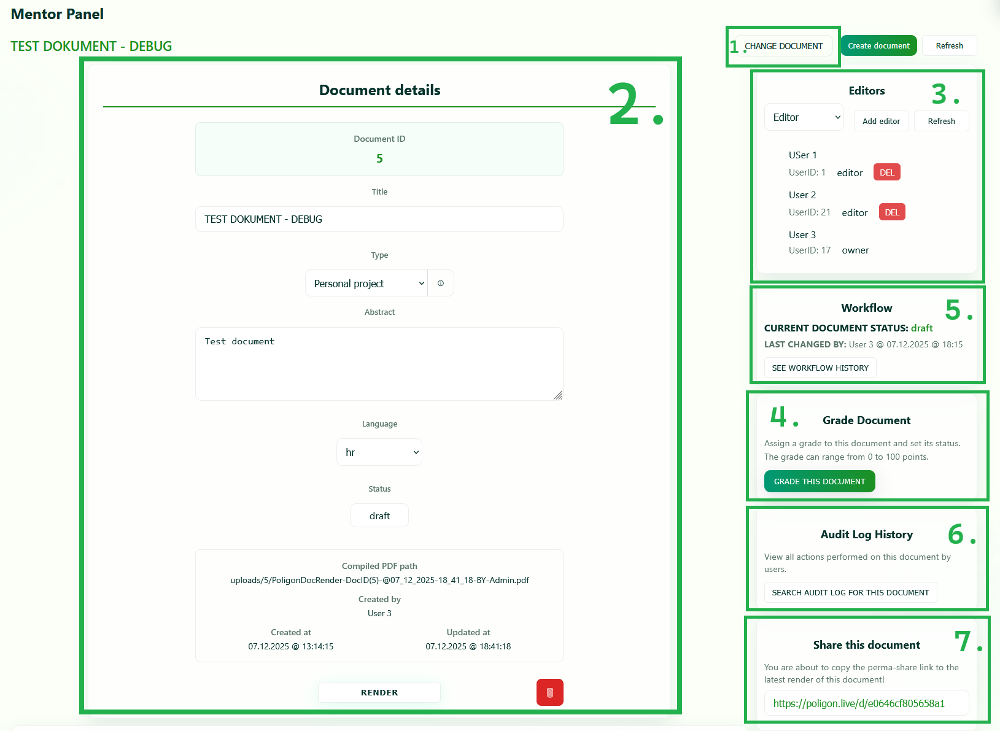
  
<em>Mentor Panel overview</em>

**Panel Sections:**

1. **Document Selector** — Click "SELECT DOCUMENT" to open the document finder, or "CHANGE DOCUMENT" to switch to a different document.
2. **Create Document Button** — Opens a modal to create a new document with title, type, language, and abstract.
3. **Document Details Card** — Shows and allows editing of document ID, title, type, abstract, language, and status. Also displays compiled PDF path, creator, and timestamps.
4. **Render Button** — Creates a permanent document version (render). This generates a PDF and increments the version number.
5. **Delete Button** — Permanently deletes the document and all associated data.
6. **Editors Card** — Lists all users with access to the document. Add new editors with role selection (viewer, editor, mentor). Change existing editor roles or remove them.
7. **Share Link Section** — After at least one render exists, displays a permanent share link. Click the link to copy it to clipboard.

### Additional Panels

  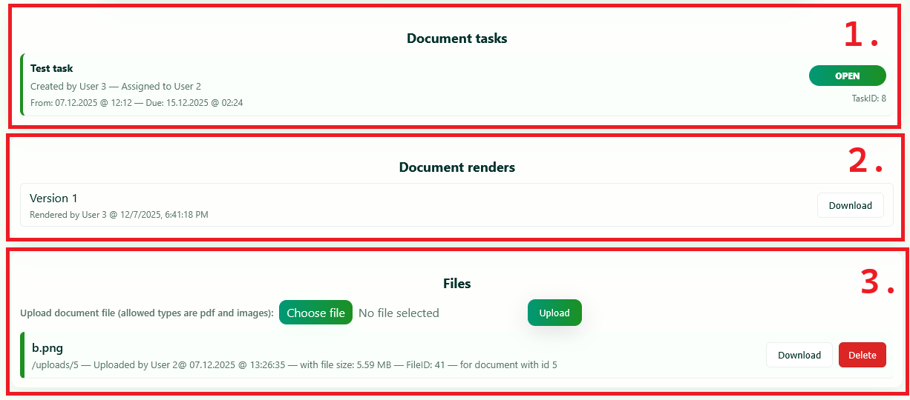
  
<em>Additional mentor panel sections</em>

1. **Document Tasks** — Lists all tasks associated with the selected document. Shows task title, creator, assignee, dates, and status.
2. **Document Renders** — Lists all permanent versions of the document. Each version shows version number, who rendered it, and when. Click "Download" to get the PDF.
3. **Files** — Manages uploaded files for the document. Upload new files, view existing files with metadata (path, uploader, timestamp, size), download or delete files.

### Workflow Management

The Workflow card displays the current document status and provides status change controls:

- **Current Status** — Shows the current workflow state
- **Last Changed By** — Who made the last status change and when
- **See Workflow History** — Opens a modal showing complete status change history

### Grading Documents

The Grade Document card allows mentors to assign grades:

- Click **GRADE THIS DOCUMENT** to open the grading modal
- If the document is "under_review", the button pulses to draw attention
- For other statuses, a confirmation dialog appears first
- Enter a grade (0-100) and confirm

After grading, additional status buttons appear:
- **SUBMITTED** — Mark as submitted to faculty (available after grading)
- **FINISHED** — Mark as finalized by faculty (available after submission)

### Audit Log

Click **SEARCH AUDIT LOG FOR THIS DOCUMENT** to view all actions performed on the document, including edits, uploads, compilations, and status changes.

---

## Admin Panel

The Admin Panel provides system-wide management capabilities for administrators.

  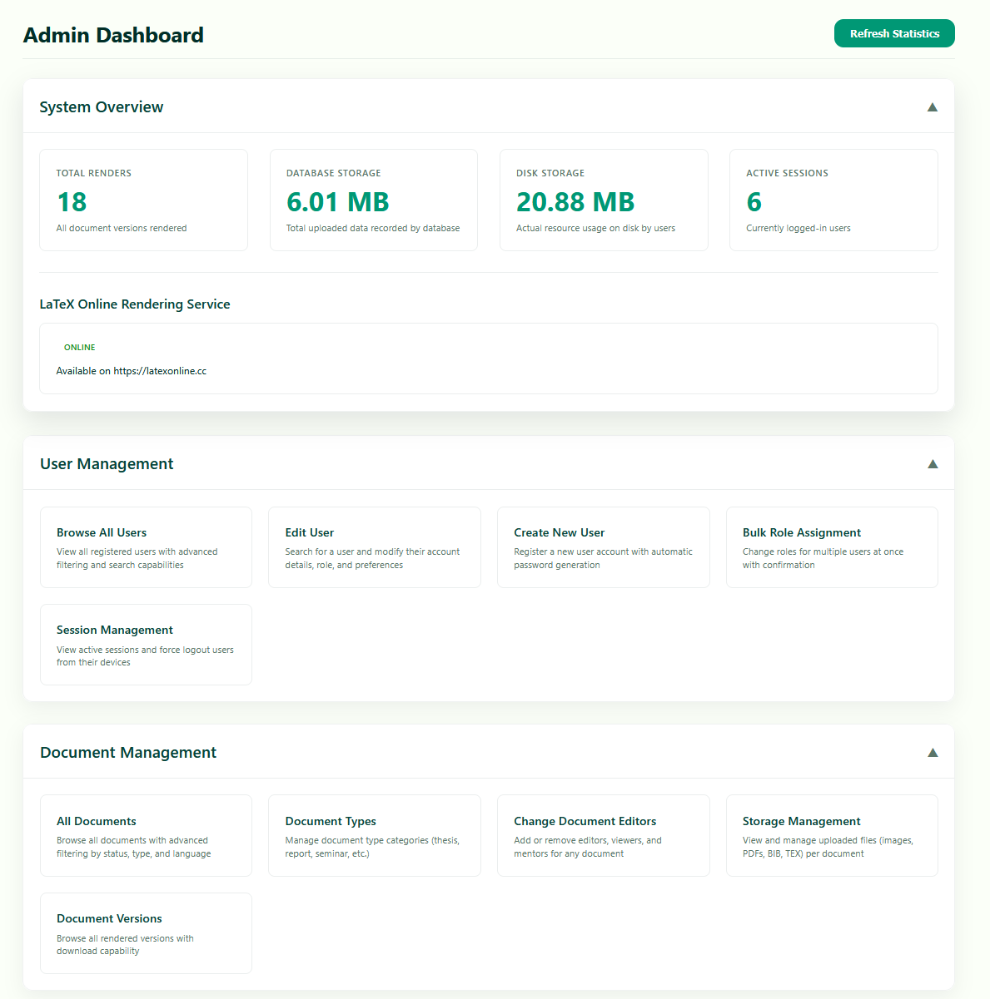
  
<em>Admin Panel dashboard</em>

### System Overview

Displays key platform statistics:

- **Total Renders** — Total number of document versions created across the platform
- **Database Storage** — Total size of uploaded data recorded in the database
- **Disk Storage** — Actual storage used on the server filesystem
- **Active Sessions** — Number of currently logged-in users
- **LaTeX Rendering Service Status** — Shows whether the external render service is online

### User Management

| Feature | Description |
|---------|-------------|
| **Browse All Users** | View complete user list with search and filtering |
| **Edit User** | Find and modify user account details, role, and preferences |
| **Create New User** | Register new accounts with automatic password generation |
| **Bulk Role Assignment** | Change roles for multiple users simultaneously |
| **Session Management** | View all active sessions and force logout users |

### Document Management

| Feature | Description |
|---------|-------------|
| **All Documents** | Browse all documents with filtering by status, type, and language |
| **Document Types** | Manage document categories (thesis, seminar, report, etc.) |
| **Change Document Editors** | Add or remove editors for any document |
| **Storage Management** | View and manage all uploaded files |
| **Document Versions** | Browse all rendered versions with download capability |

Each management feature opens in a modal window with relevant search, filter, and action capabilities.

---

## Keyboard Shortcuts

| Shortcut | Action | Available On |
|----------|--------|--------------|
| **Ctrl+S** | Save document | Documents page |
| **Ctrl+E** | Compile document | Documents page |
| **Enter** | Send message | Chat widget |
| **Escape** | Close modal/context menu | Throughout the application |

---

## Mobile Support

The Home page is fully responsive and optimized for mobile devices. However, most other pages (Documents, Tasks, Mentor Panel, Admin Panel) are designed primarily for desktop use due to their complexity.

On mobile devices:
- The main navigation menu is hidden to improve readability
- The chat widget is disabled
- Theme toggle is available in a dedicated mobile position
- Content is stacked vertically for touch interactions

For the best experience, access Poligon from a desktop or laptop computer.

---

## Troubleshooting

**Cannot compile document:**
- Check if another user is currently compiling (button shows "Locked")
- Verify your LaTeX syntax is correct
- Click "Packages Info" to see supported LaTeX packages

**Document is read-only:**
- Your role may be "viewer" for this document
- Document may be in "under_review" status (only mentors can edit)
- Check with the document owner or mentor

**Chat widget not appearing:**
- Chat is disabled on mobile devices
- Check if you disabled chat in your Profile settings
- Ensure you are logged in

**Session expired:**
- Sessions automatically expire after a period of inactivity
- Log in again to continue working

---

## Support

If you encounter issues or have questions:
- Contact the platform administrator
- Check the GitHub repository for documentation and issue tracking
- Review this guide for answers to common questions
